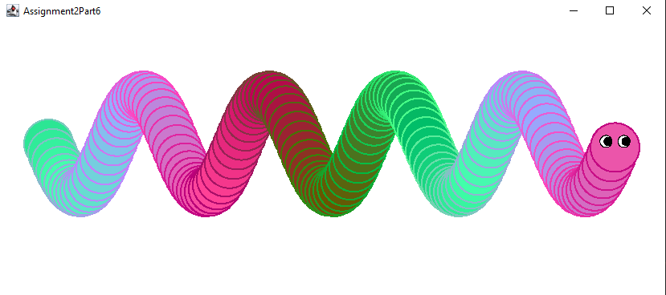

# shPlusPlus_Assignment2

This code is for the Java Course from Ш++.

> Note:
>- I'm not sure if I have the right to share the original task description, so here is a brief summary of the tasks.
>- All the tasks were based on WindowProgram.jar.

## Assignment2Part1 - Quadratic equation
Task: Write a console program that takes three double numbers (a, b, c) as input and outputs the roots of the quadratic equation  
$a*(x^2) + b*x + c = 0$ 

## Assignment2Part2 - Optical illusion  
Task: Copy the optical illusion featuring a white rectangle on a white background, with black circles behind it at each of its corners.     

## Assignment2Part3 - Paws
Task: Implement the "drawPawprint" method.   
(I know that it looks squished, the original was like this)   

## Assignment2Part4 - Flag
Task: Draw a flag made of three stripes.   

## Assignment2Part5 - Optical illusion pt2 
Task: Squares arranged horizontally and vertically with spacing between them.   

## Assignment2Part6 - Caterpillar  
Task: Draw a caterpillar using circles.   

The y-coordinate of each circle is determined using the sine function.   
The sine function returns values ranging from -1 to 1:   
 * The sine of a 0-degree angle is 0.   
 * The sine of a 90-degree angle is 1. 
 * The sine of a 180-degree angle is 0. 
 * The sine of a 270-degree angle is -1. 
 * The sine of a 360-degree angle is 0. 

But the angle can also be greater than 360 degrees. In that case, the sine simply determines the sine of the remainder after dividing the angle by 360. 
 * The sine of 370 degrees (360 + 10) = the sine of 10 degrees. 
 * The sine of 1900 degrees (360*5 + 100) = the sine of 100 degrees. 

As a result, a sine graph looks like a “wave” (https://en.wikipedia.org/wiki/Sine_and_cosine). 

Since the original sine wave ranges only from -1 to 1, we multiply it by half the distance we want it to travel. 
For example, by multiplying it by 40, it now ranges from -40 to +40 from the starting position => it will be either 40 pixels higher or 40 pixels lower, or anywhere in between. 
I hope that makes it clearer. I tried to explain it as best I could, but I’ve never been a fan of geometry :'

I got a little carried away and also created a dynamic color transition. The program changes the color of each subsequent circle by increasing or decreasing the RGB values.  
